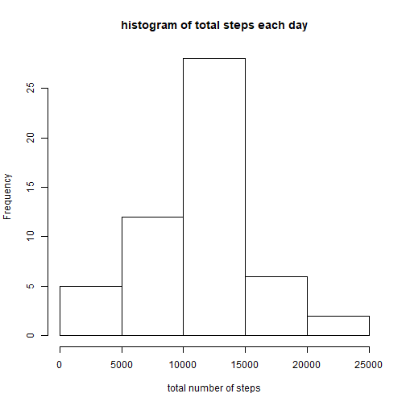
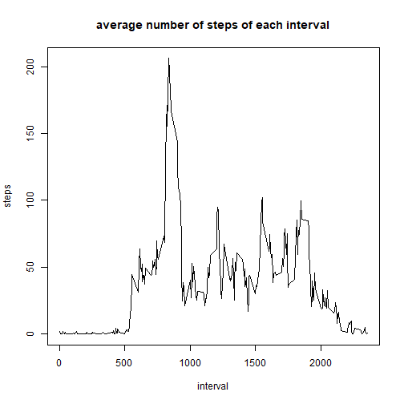

# Reproducible Research: Peer Assessment 1


## Loading and preprocessing the data

1. Load the data (note: data is unzip manually)

```r
dtset <- read.csv("activity.csv", header = T)
```

2. Process/transform the data (if necessary) into a format suitable for analysis

```r
dtset$date <- as.Date(dtset$date)
```

* A quick look at the dataset (there are missing values)

```r
head(dtset)
```

```
##   steps       date interval
## 1    NA 2012-10-01        0
## 2    NA 2012-10-01        5
## 3    NA 2012-10-01       10
## 4    NA 2012-10-01       15
## 5    NA 2012-10-01       20
## 6    NA 2012-10-01       25
```

## What is mean total number of steps taken per day?

1. Calculate the total number of steps taken per day, missing values will be ignore in this part

```r
step_per_day <- aggregate(steps~date, data = dtset, sum)
head(step_per_day)
```

```
##         date steps
## 1 2012-10-02   126
## 2 2012-10-03 11352
## 3 2012-10-04 12116
## 4 2012-10-05 13294
## 5 2012-10-06 15420
## 6 2012-10-07 11015
```

2. Make a histogram of the total number of steps taken each day

```r
hist(step_per_day$steps, main = "histogram of total steps each day", xlab = "total number of steps")
```



3. Report mean and median of the total number of steps taken per day

* Mean value of total number of steps

```r
mean(step_per_day$steps)
```

```
## [1] 10766.19
```

* Median value of total number of steps

```r
median(step_per_day$steps)
```

```
## [1] 10765
```

## What is the average daily activity pattern?

1. Make a time series plot of the 5-minute interval (x-axis) and the average number of steps taken, averaged across all days (y-axis)

```r
avgIntervalStep <- aggregate(steps~interval, data = dtset, mean)
with(avgIntervalStep, plot(interval, steps, type = "l", main = "average number of steps of each interval"))
```



2. The 5-minute interval contains the maximum number of steps, averaged across all days

* Maximum average number of steps

```r
max(avgIntervalStep$steps)
```

```
## [1] 206.1698
```

* The interval contains the maximum average number of steps

```r
avgIntervalStep$interval[which(avgIntervalStep$steps == max(avgIntervalStep$steps))]
```

```
## [1] 835
```

## Imputing missing values

Note that there are a number of days/intervals where there are missing values (coded as NA). The presence of missing days may introduce bias into some calculations or summaries of the data.

1. Report the total number of missing values in the dataset (i.e. the total number of rows with NAs)

```r
sum(is.na(dtset))
```

```
## [1] 2304
```

2. Strategy for filling in all of the missing values in the dataset: missing value is replaced with the mean value for that 5-minute interval

3. Create a new dataset that is equal to the original dataset but with the missing data filled in

```r
newdtset <- dtset
for(i in 1:nrow(newdtset)){
     if(is.na(newdtset$steps[i])){
          newdtset$steps[i] <- avgIntervalStep$steps[avgIntervalStep$interval == newdtset$interval[i]]
     }
}
```

4. Make a histogram of the total number of steps taken each day based on new dataset

```r
step_per_day1 <- aggregate(steps~date, data = newdtset, sum)
hist(step_per_day1$steps, main = "histogram of total steps each day", xlab = "total number of steps")
```


* Mean value of total number of steps taken per day

```r
mean(step_per_day1$steps)
```

```
## [1] 10766.19
```

* Median value of total number of steps taken per day

```r
median(step_per_day1$steps)
```

```
## [1] 10766.19
```

* There is no change in the mean value and only a slight change in the median value (the change is insignificant). So, imputing missing data has almost no impact on the estimates of the total daily number of steps. 

## Are there differences in activity patterns between weekdays and weekends?

1. Create a new factor variable in the dataset with two levels - "weekday" and "weekend" indicating whether a given date is a weekday or weekend day (use the dataset with the filled-in missing values)

```r
newdtset$weekday <- "weekday"
newdtset$weekday[which(weekdays(newdtset$date) == "Saturday" | weekdays(newdtset$date) == "Sunday")] <- "weekend"
newdtset$weekday <- as.factor(newdtset$weekday)
```

2. Make a panel plot containing a time series plot of the 5-minute interval (x-axis) and the average number of steps taken, averaged across all weekday days or weekend days (y-axis).

```r
avgIntervalStep1 <- aggregate(steps~interval+weekday, data = newdtset, mean)
library(lattice)
xyplot(steps~interval|weekday, data = avgIntervalStep1, type = 'l', layout = c(1,2))
```


